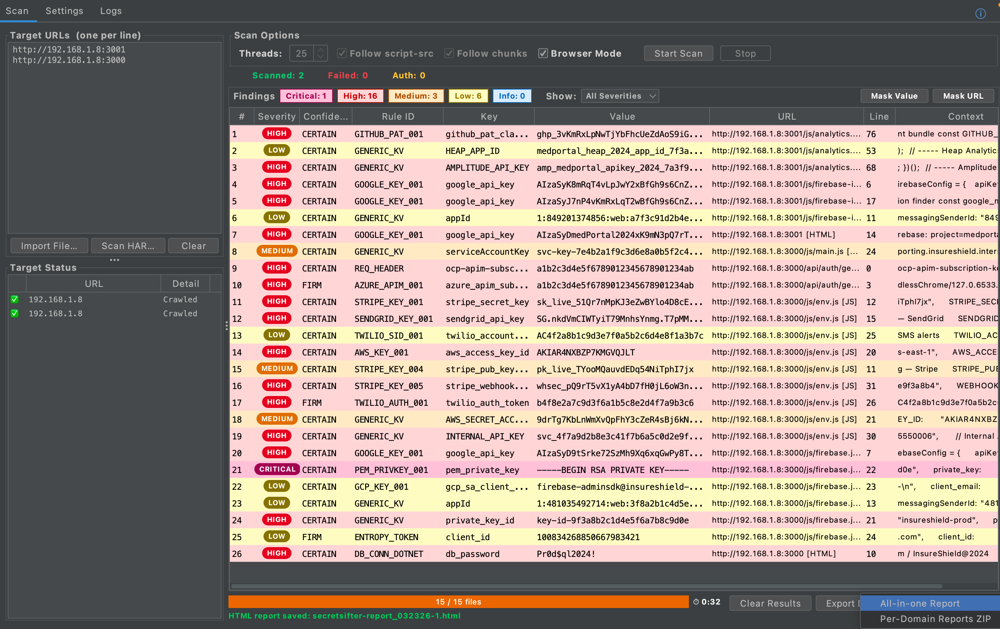
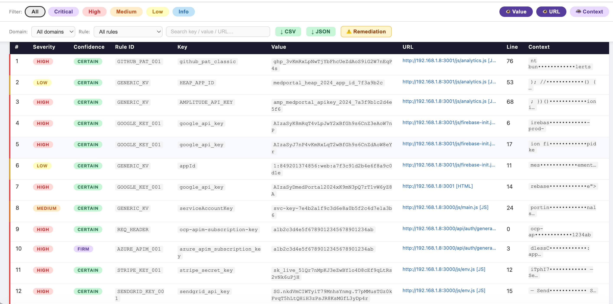
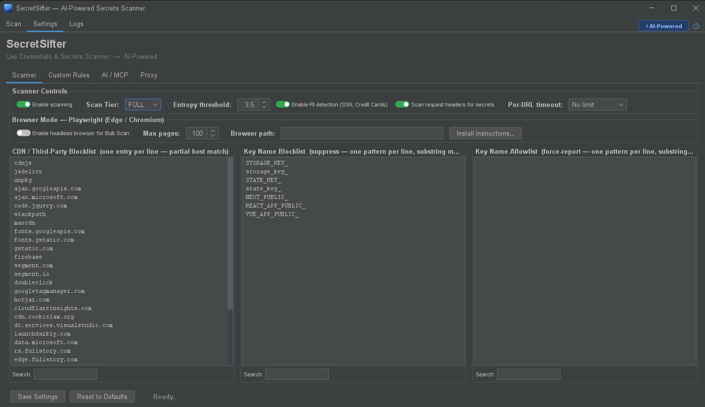
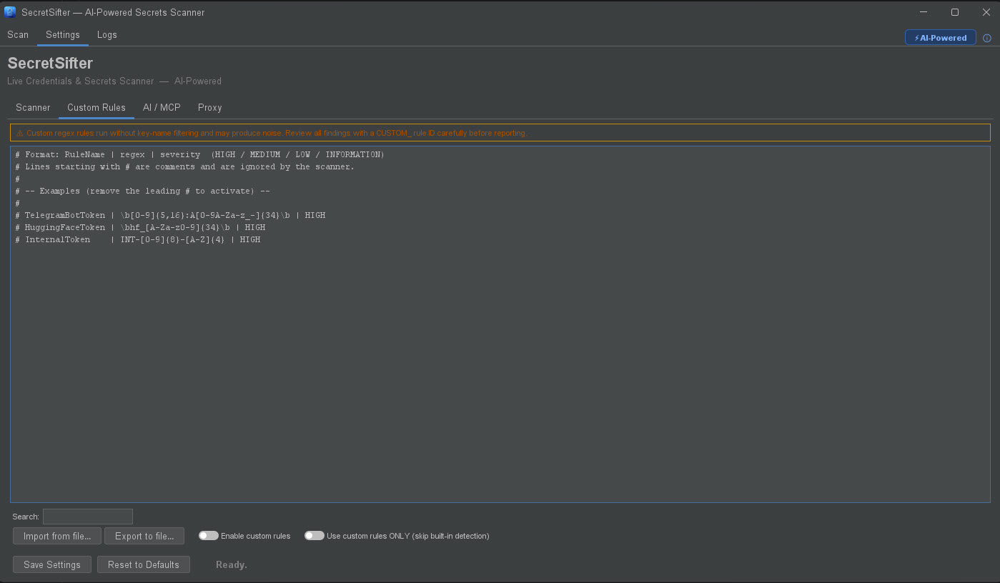
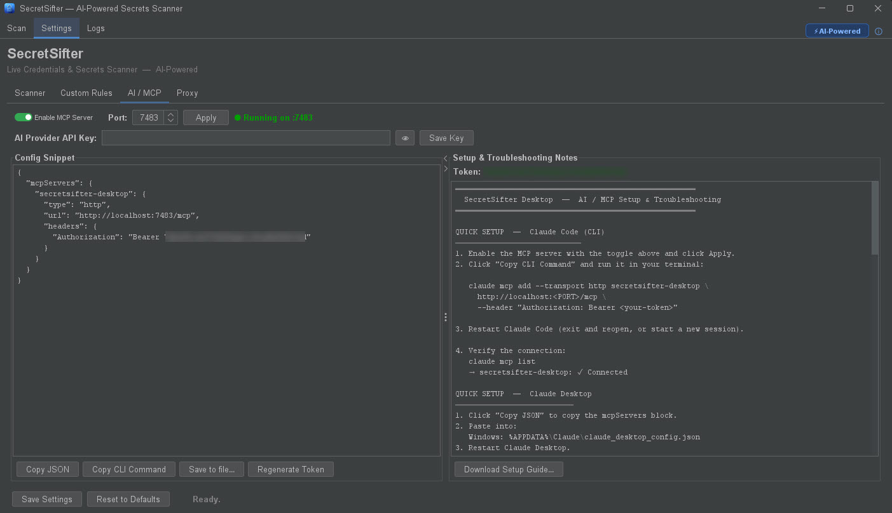
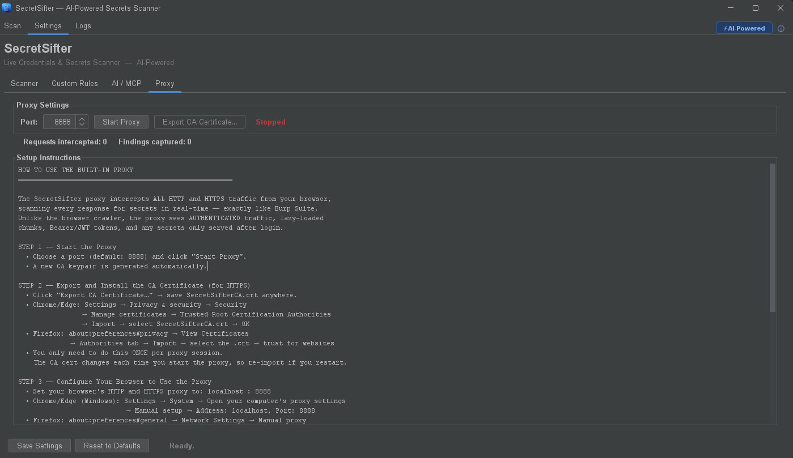
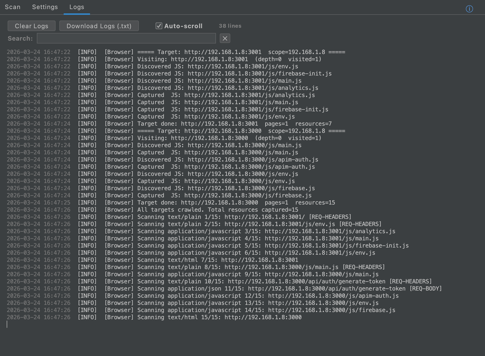

# SecretSifter Desktop

[](https://opensource.org/licenses/MIT)
[](https://github.com/secretsifter/secretsifter-desktop/releases/latest)
[](https://github.com/secretsifter/secretsifter-desktop/releases)
[](https://github.com/secretsifter/secretsifter-desktop/releases/latest)

> **A standalone secret scanner for live web applications.**
> Most secret scanners stop at the repository. The repository is not the attack surface — the running application is.

SecretSifter Desktop is a Windows-native scanner that finds API keys, credentials, tokens, and PII inside live single-page apps, API responses, request headers, JavaScript bundles, and proxied traffic. It bundles a Playwright-driven crawler, an embedded MITM proxy, HAR import, and a Bearer-authenticated REST + MCP server — no Burp licence required.

---

## ⬇️ Quick Install

1. Grab **`SecretSifter-1.7.7.exe`** from the [latest release](https://github.com/secretsifter/secretsifter-desktop/releases/latest).
2. Double-click. Windows SmartScreen → *More info → Run anyway*.
3. Per-user install, no admin rights. Default path: `%LOCALAPPDATA%\SecretSifter`.
4. Launch from Start Menu. Paste a URL into the Scan tab → click **Start Scan**.

That's it. Java is bundled. Chrome is auto-detected (or falls back to system Edge / bundled Chromium).

---

## ✨ Why SecretSifter

| Problem | SecretSifter's answer |
|---|---|
| Burp licences are expensive; not every analyst has one | Free standalone, no Burp dependency |
| API keys hardcoded in 2–8 MB Angular / React bundles | GENERIC_KV scans the **full text** with line-aware reporting (every occurrence at every line, like Burp) |
| Vendor-specific tokens (AWS, Azure, Stripe, GitHub, JWT, Google, …) | 100+ anchored CERTAIN-confidence rules |
| Secrets in OAuth `access_token=...&resource=...` bodies | Form-encoded pre-pass extracts each pair |
| Secrets in `__NEXT_DATA__` / `__INITIAL_STATE__` SSR blobs | Dedicated SSR + JSON_SCRIPT_TAG scanners |
| Secrets buried deep in JSON (`data.user.config.apiKey`) | Recursive JSON_WALK |
| WAF-blocked corporate WiFi flagging headless browsers | Crawler launches **real Chrome** with `--disable-blink-features=AutomationControlled` for Akamai / Cloudflare bypass |
| Need request/response context for each finding | Burp-style **Details** panel with Request and Response tabs |
| Custom org-specific rule packs without scanner noise | "Custom rules ONLY" toggle in **raw mode** — bypasses every default noise filter |
| Need to integrate scanner output into automation | Bearer-authenticated **REST + MCP** server |

---

## 🔍 Detection Coverage

| Family | Rules | Confidence |
|---|---|---|
| Anchored vendor tokens (AWS, Azure, GCP, Stripe, GitHub, Slack, JWT, Twilio, SendGrid, Mailgun, Heroku, npm, PyPI, etc.) | 100+ | CERTAIN |
| Context-gated rules (DB connection strings, OAuth flows, request headers) | 40+ | FIRM |
| GENERIC_KV (semantic key + entropy gate, full-text) | 1 (rich filter chain) | FIRM / CERTAIN |
| JSON_WALK (recursive deep-key walker) | 1 | FIRM |
| Entropy-gated unanchored tokens | 1 | FIRM |
| Getter-function returns (JS) | 1 | FIRM |
| SSR state blob recursion | 1 | varies |
| User-defined custom rules | unbounded | FIRM (or NOISE in raw mode) |

**Scan tiers:** FAST (vendor tokens only) · LIGHT (+ DB strings + context-gated) · FULL (+ GENERIC_KV + entropy + getter functions + SSR blobs).

---

## 🚀 Capabilities

- **Bulk URL scan** — paste 1–N URLs, optionally enable Browser Mode for SPAs.
- **Playwright crawler** — drives real Chrome, captures every request and response.
- **MITM proxy** — embedded HTTP/1.1 proxy with on-the-fly per-host TLS certs (Bouncy Castle CA). Point any browser at `127.0.0.1:8888`.
- **HAR import** — replay any DevTools-saved HAR file through the scanner; the Details panel works the same way.
- **Findings dashboard** — sortable / filterable, severity badges, NOISE triage, mask-value / mask-URL toggles, column visibility menu.
- **Capture store** — bounded LRU cache of HTTP request/response captures keyed by URL, backing the Details / Request / Response side panel.
- **Custom rules** — `RuleName | regex | severity` per line. Run additively, or in raw mode that bypasses every default noise filter.
- **Report bundles** — All-in-One ZIP (HTML + CSV + JSON + suppressed CSV) and Per-Domain ZIP. Every artifact timestamped `yyyyMMdd_HHmmss`.
- **REST + MCP** — Bearer-authenticated localhost server. Full route table (`/api/scan`, `/api/findings`, `/api/report`, `/api/settings`, `/api/rules`, `/api/logs`) + JSON-RPC at `/mcp`.

---

## 🤖 REST API Example

Once MCP is enabled (Settings → AI / MCP → Apply), automate scans from any language:

```powershell
$port  = 8765
$token = "<paste from Settings>"
$h     = @{ Authorization = "Bearer $token" }

# Start a scan
$body = @{ urls = @("https://example.com") } | ConvertTo-Json
Invoke-RestMethod -Uri "http://localhost:$port/api/scan" `
    -Method POST -Headers $h -Body $body -ContentType "application/json"

# Fetch findings
Invoke-RestMethod -Uri "http://localhost:$port/api/findings" -Headers $h |
    Format-Table severity, ruleId, keyName, value -AutoSize
```

Or via Python:

```python
import requests
h = {"Authorization": f"Bearer {TOKEN}"}
requests.post(f"http://localhost:{PORT}/api/scan", headers=h,
              json={"urls": ["https://example.com"]})
findings = requests.get(f"http://localhost:{PORT}/api/findings", headers=h).json()
```

Claude Code one-liner:

```
claude mcp add --transport http secretsifter-desktop \
    http://localhost:<port>/mcp \
    --header "Authorization: Bearer <token>"
```

---

## Screenshots

### Scan Dashboard — live findings, severity badges, Burp-style Details panel


### Scan Results — sortable, filterable findings table with severity badges


### HTML Report — filterable, shareable deliverable


### Settings — Scanner



### Settings — Custom Rules (with "Use ONLY" raw-mode toggle)



### Settings — AI / MCP server



### Settings — MITM Proxy



### Live Logs — proxy intercepts, crawler activity, scan progress


---

## 📚 Documentation

Two PDF-ready HTML companions ship with each release:

- **[Engineering Reference](https://github.com/secretsifter/secretsifter-desktop/releases/latest)** — pipeline phases, every rule family, two-pass dedup architecture, capture-store internals, threading model, hardcoded thresholds, full version history.
- **[User Documentation](https://github.com/secretsifter/secretsifter-desktop/releases/latest)** — installation guide, every workflow, severity / confidence model, triage guide, settings reference, REST API quickstart, troubleshooting.

---

## ⚙️ System Requirements

- Windows 10 / 11 (x64)
- ~500 MB disk space (installer + bundled JRE + Chromium fallback)
- No admin rights required (per-user install)
- Java is bundled — no external JRE needed
- Google Chrome recommended for best WAF-bypass coverage; the crawler falls back to bundled Chromium / system Edge if Chrome is absent

---

## 🔨 Building from Source

```powershell
# Prerequisites: JDK 17+ with jpackage, WiX Toolset 3.11+ on PATH

cd secretsifter-windows
.\gradlew.bat reinsertObfuscatedClasses    # obfuscated fat JAR (~1m)
.\gradlew.bat buildAppImage                # portable app folder (~2m)
.\gradlew.bat buildExeInstaller            # full Windows EXE installer (~3m)
```

> **Build hygiene:** delete every `secretsifter-<version>.jar` in `build/libs/` except the current version before each `buildExeInstaller` run. `jpackage --input` bundles every file in that directory into the installer image; stale per-version JARs balloon the EXE from ~240 MB to 1.8+ GB and can fail the WiX link step.

Output:

| Path | Artifact |
|---|---|
| `build/libs/secretsifter-<ver>.jar` | Obfuscated fat JAR |
| `build/app-image-protected/SecretSifter/` | Portable folder + JRE |
| `build/exe-installer/SecretSifter-<ver>.exe` | Windows installer |

---

## 🛡️ Authorized Use Only

SecretSifter is a security research and penetration testing tool. Use it **only** against systems you own or have explicit written authorisation to test. Unauthorised scanning of third-party systems may violate the Computer Fraud and Abuse Act (US), the UK Computer Misuse Act, the EU Directive on Attacks Against Information Systems, or equivalent local legislation. The author and contributors disclaim all liability for misuse.

---

## 📜 License

[MIT License](LICENSE.txt) · Copyright © 2024–2026 Hemanth Gorijala.

The desktop edition bundles open-source components: Playwright for Java (Apache 2.0), Bouncy Castle (MIT-style), org.json (JSON License), Chromium (BSD), OpenJDK 21 (GPLv2 + Classpath Exception), WiX Toolset (MS-RL, build-time only).

---

<sub>SecretSifter v1.7.7 · Windows Desktop Edition · Author: Hemanth Gorijala · MIT License</sub>
