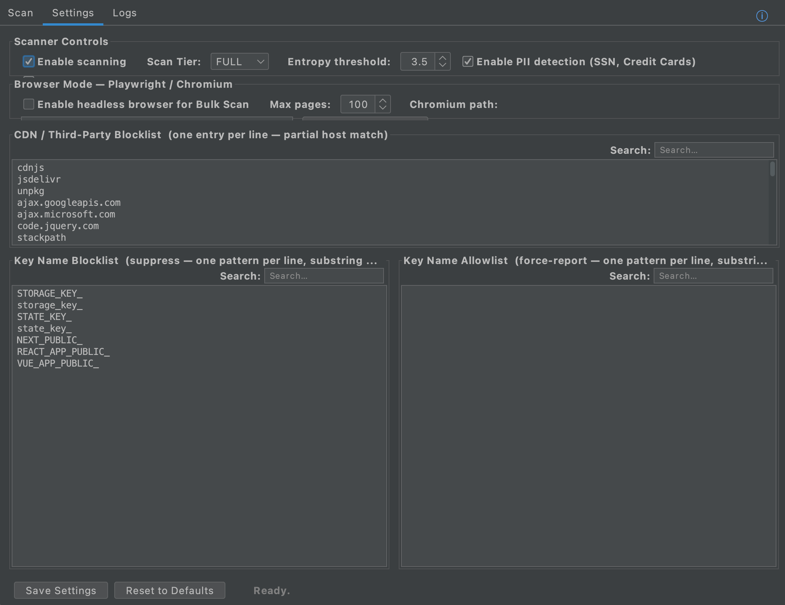

# SecretSifter Desktop

**Standalone desktop application for macOS and Windows**
Real-time secrets and credentials scanner for web application security testing.

---

## Why SecretSifter?

Most secret scanners stop at the repository. They clone, they grep, they report.
But the repository is not the attack surface — the running application is.
That is where secrets actually leak — bundled into minified JavaScript, injected
into server-rendered HTML, returned in API responses that no static tool ever sees.

SecretSifter was built for that gap — scanning the running application, not the source tree.

It is used by two groups of people:

**Security professionals** — penetration testers, bug bounty hunters, and red teamers
conducting blackbox assessments. Point it at a target with no source access and find
what is exposed at runtime before anyone else does.

**Development and security teams** — verify your own application before it ships. Run
SecretSifter against your staging or production environment to catch secrets that slipped
past code review — hardcoded in a bundle, injected into SSR state, or leaking through
an API response your scanner never saw.

SecretSifter ships in three forms to fit every workflow:

- **Desktop app** — blackbox URL scanning with a real browser, 160+ detection patterns,
  entropy analysis, and offline HTML reports. macOS and Windows.
- **Browser extension** — passive scanning while you browse. Chrome and Firefox. Every
  page you visit is analysed in the background, zero extra steps.
- **Burp Suite extension** — secret detection inside your proxy. Findings appear directly
  in Burp as you intercept and replay traffic during an engagement.

The secrets that end up in breach reports and bug bounty submissions are rarely in the repo.
They are in the running app — and that is exactly where SecretSifter looks.

---

## Quick Start

1. Download the installer for your platform from [Releases](https://github.com/secretsifter/secretsifter-desktop/releases/latest)
2. Install and launch SecretSifter
3. Paste one or more target URLs into the Scan tab → click **Start Scan**

Findings appear in real time. Export an HTML report when done.
For JavaScript-heavy targets, enable **Browser Mode** in Settings to drive a full Chromium browser through the target.

---

## System Requirements

| | macOS | Windows |
|--|-------|---------|
| **OS** | macOS 11 or later | Windows 10 or later |
| **Java** | Bundled — no install needed | Java 17+ required |
| **Disk (app)** | ~165 MB | ~165 MB |
| **Disk (Browser Mode)** | +~120 MB for Chromium (one-time download) | +~120 MB for Chromium (one-time download) |
| **RAM** | 512 MB recommended | 512 MB recommended |

---

## What It Scans

SecretSifter analyses the following sources for exposed secrets:

| Source | Details |
|--------|---------|
| **JavaScript files** | Inline `<script>` blocks and external `.js` files fetched during crawl |
| **HTML pages** | Full page source including embedded config, meta tags, and SSR state |
| **API responses** | JSON and XML responses returned during page load and XHR/fetch calls |
| **HAR archives** | Import recorded traffic from Burp Suite or browser DevTools |
| **Request headers** | `Authorization`, `X-Api-Key`, `Cookie`, and other credential-bearing headers |
| **Script sources** | External scripts loaded by the page (with "Follow Script Sources" enabled) |

In **Browser Mode** (Playwright/Chromium), SecretSifter drives a real browser to capture
dynamically loaded content — React, Angular, Vue, and other SPAs included.

---

## Key Features

- **160+ detection patterns** — API keys, OAuth tokens, JWTs, cloud credentials (AWS, GCP,
  Azure), database connection strings, private keys, PII, and more
- **3 scan tiers** — Fast (quick recon), Light (general use), Full (thorough engagements)
- **Shannon entropy analysis** — catches unknown high-entropy secrets not covered by named
  patterns
- **Live browser crawling** — drives a real browser to reach dynamically loaded JavaScript
  content that static scanners miss
- **Severity scoring** — findings classified as Critical, High, Medium, or Low with context
  snippets
- **Interactive HTML reports** — shareable, filterable reports ready for client deliverables
- **Bulk URL scanning** — paste a list of targets and scan them all in one run
- **HAR import** — drop in a HAR file recorded from Burp Suite or browser DevTools and scan
  offline
- **Exclusion rules** — filter out false positives by domain, pattern, or keyword
- **Real-time scan log** — watch the crawler work live, URL by URL
- **Works offline** — no data leaves your machine; no cloud dependency

---

## Download

| Platform | Version | Download |
|----------|---------|----------|
| macOS (Apple Silicon + Intel) | v1.1.0 | [SecretSifter-1.1.0.dmg](https://github.com/secretsifter/secretsifter-desktop/releases/latest) |
| Windows (x64) | v1.1.0 | [SecretSifter-Setup-1.1.0.exe](https://github.com/secretsifter/secretsifter-desktop/releases/latest) |

> Installers are attached to [GitHub Releases](https://github.com/secretsifter/secretsifter-desktop/releases).
> They are not stored in this repository due to size.

---

## Screenshots

### Scan Dashboard — live findings with severity badges

### HTML Report — filterable, shareable deliverable

### Settings — customise patterns, exclusions, and crawl depth

### Scan Log — real-time browser crawl activity

---

## Installation

**macOS**
1. Download `SecretSifter-1.1.0.dmg` from Releases
2. Open the DMG and drag SecretSifter to Applications
3. On first launch, right-click → Open (required on macOS for unsigned apps)

**Windows**
1. Download `SecretSifter-Setup-1.1.0.exe` from Releases
2. Run the installer — Windows SmartScreen may prompt; click **More info → Run anyway**
3. Launch SecretSifter from the Start menu or desktop shortcut

---

## User Guides

- [SecretSifter User Guide — macOS](macos/SecretSifter-UserGuide-MACOS.md)
- [SecretSifter User Guide — Windows](windows/SecretSifter-UserGuide-Windows.md)

---

## Part of the SecretSifter Ecosystem

| Product | Description |
|---------|-------------|
| **SecretSifter Desktop** | This repo — standalone macOS/Windows app for blackbox scanning |
| [SecretSifter Browser Extension](https://github.com/secretsifter/secretsifter-extension) | Firefox extension for passive in-browser scanning | [Install on Firefox] (https://addons.mozilla.org/en-US/firefox/addon/secretsifter-extension/)
| [SecretSifter Burp Suite Extension](https://github.com/secretsifter/secretsifter-burp) | Burp Suite plugin for proxy-level secret detection |

---

## License

© 2026 Hemanth Gorijala — See [LICENSE.txt](LICENSE.txt) for full terms.
